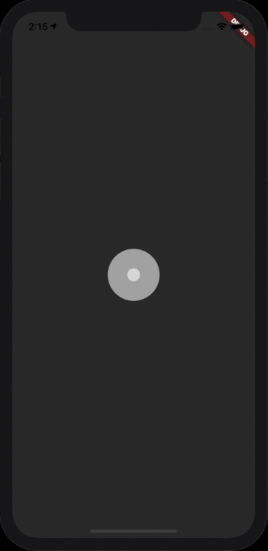

# Weather Pets

A pet-themed weather app in Flutter that retrieves the most accurate weather data from https://openweathermap.org/api. The app uses your location to give you real-time weather updates, with the background images changing with the weather. Not a dog person? No worries! You can easily switch between cat and dog mode.

Design inspiration from Giannina Thomas https://www.gthomasdesigns.com/

